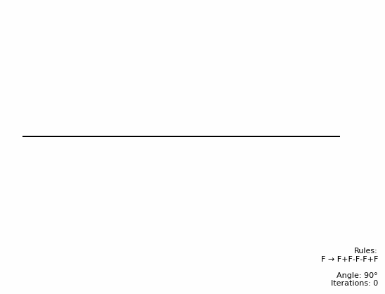
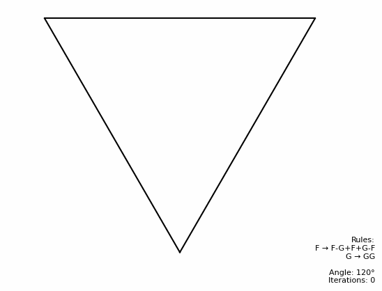
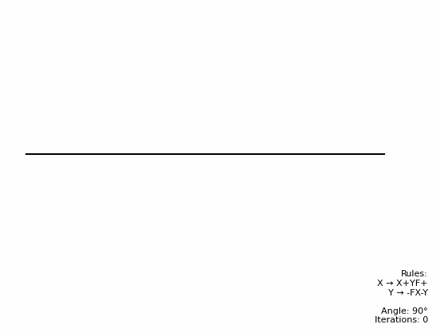

# 🌿 L-System Fractals Generator

Welcome to the **L-System Fractals Generator**! This project creates fractal images using the **Lindenmayer system (L-System)**. It supports popular fractals like the **Koch Curve**, **Sierpiński Triangle**, and **Dragon Curve**, and compiles them into mesmerizing GIFs to visualize their growth over iterations. 

---

## 🌟 Features

- **Generate Fractals**: Create fractals like the Koch Curve, Sierpiński Triangle, and Dragon Curve.
- **Customizable Rules**: Define your own L-System rules, angles, and iterations.
- **GIF Creation**: Watch your fractals grow over time with automatically generated GIFs.
- **Easy to Use**: Simple Python scripts to generate and visualize fractals.

---

## 🖼️ Fractals Implemented

### 1. **Koch Curve** ❄️
A simple fractal that replaces line segments with a repeating pattern.

---

### 2. **Sierpiński Triangle** 🔺
A fractal triangle created by recursively removing smaller triangles.

---

### 3. **Dragon Curve** 🐉
A complex fractal curve generated by repeatedly folding a line in half.

---

## 🚀 How It Works

1. **Define the L-System**: Specify the axiom, rules, angle, and number of iterations.
2. **Generate the Fractal**: Use the `lsystem.py` script to generate the fractal's structure.
3. **Visualize the Fractal**: Draw the fractal and save it as an image.
4. **Create a GIF**: Use the `gifmaker.py` script to compile the images into a GIF.

---
#### Author: Filip Hajduch
###### and ChatGPT