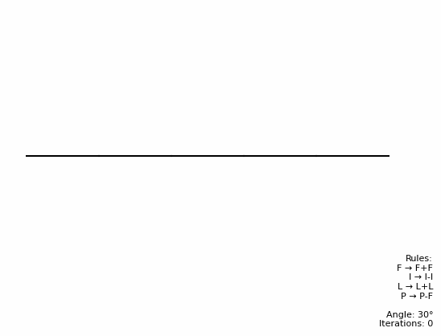
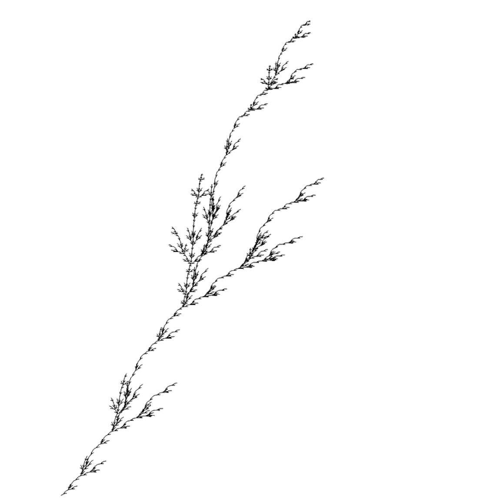

# 🌿 L-System Fractals Generator

Welcome to the **L-System Fractals Generator**! This project creates fractal images using the **Lindenmayer system (L-System)**. It supports both 2D and 3D fractal generation, including popular fractals like the **Koch Curve**, **Sierpiński Triangle**, and **Dragon Curve**, and compiles them into mesmerizing GIFs to visualize their growth over iterations.

---

## 🌟 Features

- **2D and 3D Fractal Generation**: Create both 2D fractals and 3D models
- **Multiple Classic Fractals**: Generate Koch Curve, Sierpiński Triangle, Dragon Curve, and more
- **3D Visualization**: Export 3D L-systems as .obj files for viewing in 3D software
- **Customizable Rules**: Define your own L-System rules, angles, and iterations
- **GIF Creation**: Watch your 2D fractals evolve over time with automatically generated GIFs
- **Easy to Use**: Simple Python scripts to generate and visualize fractals

---

## 🖼️ 2D Fractals Implemented

### 1. **Koch Curve** ❄️
A simple fractal that replaces line segments with a repeating pattern.
- **Axiom**: `F`
- **Rules**: `F → F+F-F-F+F`
- **Angle**: `90°`
- **Iterations**: `4`

---

### 2. **Sierpiński Triangle** 🔺
A fractal triangle created by recursively removing smaller triangles.
- **Axiom**: `F-G-G`
- **Rules**:
  - `F → F-G+F+G-F`
  - `G → GG`
- **Angle**: `120°`
- **Iterations**: `5`

---

### 3. **Dragon Curve** 🐉
A complex fractal curve generated by repeatedly folding a line in half.

- **Axiom**: `FX`
- **Rules**:
  - `X → X+YF+`
  - `Y → -FX-Y`
- **Angle**: `90°`
- **Iterations**: `10`
- 

---

### 4. **Custom Fractals** ✨
This custom fractal is based on the letters of my name, **FILIP**. Each letter is assigned a unique rule to generate a visually distinct pattern. The fractal evolves over multiple iterations, creating a complex and artistic design.

- **Axiom**: `FILIP`
- **Rules**:
  - `F → F+F`
  - `I → I-I`
  - `L → L+L`
  - `P → P-F`
- **Angle**: `30°`
- **Iterations**: `11`

The result is a personalized fractal that reflects the structure of my name while showcasing the beauty of L-Systems.

## 🌲 3D L-Systems

### 5. **3D tree** 🌌
A 3D tree fractal generated using the L-System rules. The tree grows in three dimensions with branches extending in multiple directions, creating a realistic tree-like structure.

- **Axiom**: `F`
- **Rules**: `F → F[+F][-F]&F^F`
- **Angle**: `25°`
- **Iterations**: `5`

The 3D model is exported as an .obj file, allowing for detailed examination from any angle.

## 🚀 How It Works

1. **Define the L-System**: Specify the axiom, rules, angle, and number of iterations.
2. **Generate the Fractal**: 
   - For 2D: Use the `lsystem.Lsystem()` function to generate and visualize the fractal's structure.
   - For 3D: Use the `lsystem.Lsystem3D()` function to generate a 3D model saved as .obj.
3. **Visualize the Results**: 
   - 2D fractals are drawn and saved as images
   - 3D models are saved in .obj format for viewing in 3D modeling software
4. **Create a GIF**: For 2D fractals, use the `gifmaker.py` script to compile the images into a GIF.

---
#### Author: Filip Hajduch
###### and ChatGPT